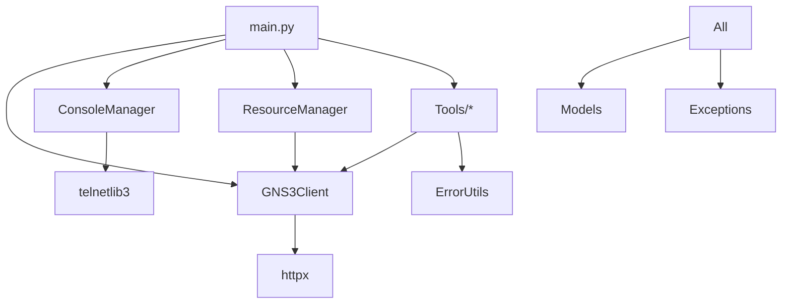

# GNS3 MCP Server Architecture Review

## Executive Summary

The GNS3 MCP Server is a Model Context Protocol (MCP) implementation providing programmatic access to GNS3 network simulation labs. After comprehensive analysis, the architecture demonstrates **moderate to good** quality with clear strengths in modularity and error handling, but reveals opportunities for improvement in dependency management, abstraction layers, and architectural consistency.

**Overall Architecture Grade: B+ (7.5/10)**

### Key Findings
- **Strengths**: Clean separation of concerns, robust error handling, comprehensive type safety
- **Weaknesses**: Tight coupling in some areas, missing abstraction layers, inconsistent patterns
- **Critical Issues**: None that prevent functionality
- **Recommended Priority**: Medium-term refactoring to improve maintainability

## 1. System Structure Assessment

### Component Hierarchy

```
gns3_mcp/
├── server/
│   ├── main.py                 # FastMCP server entry (1600+ LOC - TOO LARGE)
│   ├── gns3_client.py          # GNS3 API client
│   ├── console_manager.py      # Telnet session management
│   ├── models.py               # Pydantic data models
│   ├── exceptions.py           # Exception hierarchy
│   ├── batch_models.py         # Batch operation models
│   ├── link_validator.py       # Two-phase validation
│   ├── error_utils.py          # Error formatting utilities
│   ├── export_tools.py         # Export functionality
│   ├── tools/                  # Tool implementations (8 modules)
│   ├── resources/              # Resource handlers (3 modules)
│   └── prompts/                # AI guidance prompts (5 modules)
```

### Architectural Patterns Identified

**✅ Positive Patterns:**
1. **Layered Architecture**: Clear separation between API client, business logic, and MCP interface
2. **Repository Pattern**: ResourceManager acts as data access layer
3. **Command Pattern**: Batch operations with two-phase validation
4. **Factory Pattern**: Tool registration and dynamic dispatch

**⚠️ Anti-patterns Detected:**
1. **God Object**: `main.py` with 1600+ lines handling multiple responsibilities
2. **Circular Dependencies**: Potential with TYPE_CHECKING imports
3. **Anemic Domain Models**: Models are mostly data containers without behavior
4. **Service Locator**: Global `_app` context is an anti-pattern

### Module Boundaries

**Well-Defined Boundaries:**
- `gns3_client.py`: Clean API abstraction
- `exceptions.py`: Comprehensive error hierarchy
- `models.py`: Type-safe data structures
- `console_manager.py`: Isolated telnet management

**Problematic Boundaries:**
- `main.py`: Mixed concerns (resources, tools, lifecycle, validation)
- Tools spread across multiple files without clear organization
- SSH functionality split between tools and external proxy

## 2. Design Pattern Evaluation

### Patterns Successfully Implemented

#### Two-Phase Validation Pattern (link_validator.py)
```python
# Excellent pattern for preventing partial failures
class LinkValidator:
    def validate_all_operations(operations) -> List[ValidationResult]
    def execute_operations(operations) -> List[ExecutionResult]
```
**Grade: A** - Prevents inconsistent network states

#### Structured Exception Hierarchy
```python
GNS3Error
├── GNS3NetworkError
├── GNS3APIError
├── GNS3AuthError
├── NodeNotFoundError
└── ValidationError
```
**Grade: A** - Rich context, actionable suggestions

#### Batch Operation Result Pattern
```python
class BatchOperationResult:
    succeeded: List[Dict]
    failed: List[Dict]
    skipped: List[Dict]
```
**Grade: B+** - Good tracking, could use generics

### Patterns Missing or Poorly Implemented

#### Missing: Strategy Pattern for Node Operations
Current implementation uses string matching for actions. Should use:
```python
class NodeOperationStrategy(ABC):
    @abstractmethod
    async def execute(self, node: Node) -> Result

class StartNodeStrategy(NodeOperationStrategy):
    async def execute(self, node: Node) -> Result:
        # Implementation
```

#### Missing: Chain of Responsibility for Error Handling
Current error handling is scattered. Should implement:
```python
class ErrorHandler(ABC):
    def __init__(self, next_handler: Optional[ErrorHandler] = None):
        self._next = next_handler

    @abstractmethod
    def handle(self, error: Exception) -> Optional[ErrorResponse]:
```

#### Poor: Singleton Pattern (Global App Context)
```python
# Current anti-pattern
_app: AppContext | None = None  # Global state

# Should be:
class AppContextManager:
    _instance: Optional['AppContextManager'] = None

    def __new__(cls):
        if cls._instance is None:
            cls._instance = super().__new__(cls)
        return cls._instance
```

## 3. Dependency Architecture Analysis

### Dependency Graph



### Coupling Analysis

**Tight Coupling Issues:**
1. **main.py → everything**: Main module imports 20+ modules directly
2. **tools → AppContext**: Tools directly access app context internals
3. **Circular potential**: TYPE_CHECKING imports create hidden dependencies

**Loose Coupling Success:**
1. **GNS3Client**: Well-isolated with clear interface
2. **ConsoleManager**: Independent session management
3. **Models/Exceptions**: Pure data structures with no dependencies

### Dependency Inversion Violations

```python
# Current violation - concrete dependency
from main import AppContext  # Tools depend on concrete implementation

# Should be:
from abc import ABC
class IAppContext(ABC):  # Interface
    @abstractmethod
    async def get_gns3_client(self) -> IGns3Client:
        pass
```

## 4. Data Flow Analysis

### Information Flow Patterns

```
User Request → MCP Tool → Validation → Business Logic → GNS3 Client → GNS3 Server
                             ↓                ↓
                          Error Utils    Resource Manager
                             ↓                ↓
                        Error Response   Formatted Output
```

### State Management

**Current State Management:**
- Session state in ConsoleManager (good isolation)
- Project state in AppContext (acceptable)
- SSH proxy mapping in AppContext (problematic - should be separate)

**Issues:**
1. **Global state mutation**: `_app` global is modified during runtime
2. **State synchronization**: No clear mechanism for state consistency
3. **Missing state persistence**: Session state lost on restart

### Data Transformation Pipeline

```python
# Good: Clear transformation pipeline
Raw GNS3 Data → Pydantic Models → Business Logic → Output Format

# Example:
node_dict → NodeInfo → node_operations → NodeSummary → JSON/Table
```

## 5. Scalability & Performance Analysis

### Current Performance Characteristics

**Strengths:**
1. **Async throughout**: All I/O operations are async
2. **Connection pooling**: httpx client reuse
3. **Batch operations**: Support for bulk operations
4. **Parallel execution**: Wildcard operations run concurrently

**Weaknesses:**
1. **No caching layer**: Every request hits GNS3 API
2. **Buffer management**: Console buffers grow unbounded (10MB limit but no streaming)
3. **Session cleanup**: Periodic cleanup every 5 minutes (should be event-driven)

### Scalability Bottlenecks

1. **Single AppContext**: Cannot scale horizontally
2. **In-memory session storage**: Limited by server memory
3. **Synchronous validation**: Two-phase validation is sequential
4. **No request queuing**: Direct execution without throttling

### Performance Improvements Needed

```python
# Add caching layer
class CachedGNS3Client:
    def __init__(self, client: GNS3Client, cache: ICache):
        self.client = client
        self.cache = cache

    async def get_project(self, project_id: str):
        key = f"project:{project_id}"
        if cached := await self.cache.get(key):
            return cached
        result = await self.client.get_project(project_id)
        await self.cache.set(key, result, ttl=60)
        return result
```

## 6. Security Architecture Review

### Trust Boundaries

```
External → MCP Protocol → Authentication → GNS3 API → Network Devices
           ↓                    ↓              ↓           ↓
        Untrusted          JWT Token      Validated    SSH Keys
```

### Security Strengths

1. **JWT Authentication**: Proper token-based auth
2. **No credential logging**: Passwords marked sensitive
3. **Environment variables**: Credentials not hardcoded
4. **SSL support**: HTTPS with certificate validation

### Security Weaknesses

1. **No rate limiting**: Vulnerable to DOS
2. **Missing input sanitization**: Direct string interpolation in some places
3. **Telnet usage**: Inherently insecure protocol (by design for lab environment)
4. **No audit logging**: Security events not tracked

### Recommended Security Enhancements

```python
# Add rate limiting
from fastapi import Request
from fastapi.middleware.trustedhost import TrustedHostMiddleware
from slowapi import Limiter

limiter = Limiter(key_func=lambda: "global", default_limits=["100/minute"])

# Add input validation
from pydantic import validator

class NodeName(str):
    @validator('node_name')
    def validate_node_name(cls, v):
        if not re.match(r'^[a-zA-Z0-9_-]+$', v):
            raise ValueError('Invalid node name')
        return v
```

## 7. SOLID Principle Compliance

### Single Responsibility Principle (SRP)
**Grade: C**
- ❌ `main.py` violates SRP heavily (resources + tools + lifecycle)
- ✅ `gns3_client.py` follows SRP well
- ✅ `console_manager.py` has single responsibility

### Open/Closed Principle (OCP)
**Grade: B**
- ✅ Exception hierarchy is extensible
- ✅ Tool registration allows adding new tools
- ❌ Resource patterns hardcoded in ResourceManager

### Liskov Substitution Principle (LSP)
**Grade: A**
- ✅ All exceptions properly extend base class
- ✅ Pydantic models maintain contracts

### Interface Segregation Principle (ISP)
**Grade: D**
- ❌ No explicit interfaces defined
- ❌ Tools depend on entire AppContext
- ❌ Fat interfaces throughout

### Dependency Inversion Principle (DIP)
**Grade: D**
- ❌ Direct concrete dependencies everywhere
- ❌ No abstraction layers
- ❌ High-level modules depend on low-level

## 8. Specific Improvement Recommendations

### Priority 1: Critical Refactoring (1-2 weeks)

#### 1.1 Split main.py into multiple modules
```python
# Proposed structure:
gns3_mcp/server/
├── app.py           # Application setup and lifecycle
├── resources.py     # Resource definitions
├── tools.py         # Tool definitions
├── context.py       # AppContext management
└── main.py          # Entry point only
```

#### 1.2 Introduce abstraction layers
```python
# Create interfaces for all major components
from abc import ABC, abstractmethod

class IGns3Client(ABC):
    @abstractmethod
    async def authenticate(self) -> bool: pass

class IConsoleManager(ABC):
    @abstractmethod
    async def connect(self, host: str, port: int) -> str: pass

class IResourceManager(ABC):
    @abstractmethod
    async def get_resource(self, uri: str) -> str: pass
```

#### 1.3 Implement proper dependency injection
```python
# Use dependency injection container
from typing import Protocol

class Dependencies:
    def __init__(self):
        self._services = {}

    def register(self, interface: type, implementation: any):
        self._services[interface] = implementation

    def get(self, interface: type):
        return self._services[interface]

# Usage
deps = Dependencies()
deps.register(IGns3Client, GNS3Client())
```

### Priority 2: Architecture Enhancements (2-4 weeks)

#### 2.1 Implement caching layer
```python
class CacheManager:
    def __init__(self, backend: CacheBackend):
        self.backend = backend
        self.ttls = {
            'project': 300,  # 5 minutes
            'node': 60,      # 1 minute
            'template': 3600 # 1 hour
        }
```

#### 2.2 Add Command/Query separation (CQRS lite)
```python
# Separate read and write operations
class QueryHandler:
    async def get_nodes(self, project_id: str) -> List[Node]

class CommandHandler:
    async def start_node(self, node_id: str) -> Result
```

#### 2.3 Implement event-driven architecture
```python
# Add event bus for decoupling
class EventBus:
    async def publish(self, event: Event)
    async def subscribe(self, event_type: type, handler: Callable)

# Events
@dataclass
class NodeStartedEvent:
    node_id: str
    timestamp: datetime
```

### Priority 3: Long-term Improvements (1-2 months)

#### 3.1 Migrate to plugin architecture
```python
class ToolPlugin(ABC):
    @property
    @abstractmethod
    def name(self) -> str: pass

    @abstractmethod
    async def execute(self, context: IContext, **params) -> Result: pass

class PluginManager:
    def load_plugins(self, directory: Path):
        # Dynamic plugin loading
```

#### 3.2 Implement proper state machine
```python
from enum import Enum
from transitions import Machine

class NodeState(Enum):
    STOPPED = "stopped"
    STARTING = "starting"
    STARTED = "started"
    STOPPING = "stopping"

class NodeStateMachine:
    states = [s.value for s in NodeState]
    transitions = [
        {'trigger': 'start', 'source': 'stopped', 'dest': 'starting'},
        {'trigger': 'started', 'source': 'starting', 'dest': 'started'},
    ]
```

#### 3.3 Add comprehensive telemetry
```python
from opentelemetry import trace, metrics

tracer = trace.get_tracer(__name__)
meter = metrics.get_meter(__name__)

class InstrumentedGNS3Client(GNS3Client):
    @tracer.start_as_current_span("gns3.get_project")
    async def get_project(self, project_id: str):
        # Automatic tracing
```

## 9. Implementation Roadmap

### Phase 1: Foundation (Week 1-2)
1. Create abstraction interfaces
2. Split main.py into logical modules
3. Implement dependency injection
4. Add comprehensive unit tests

### Phase 2: Core Refactoring (Week 3-4)
1. Refactor tools to use strategies
2. Implement caching layer
3. Add event bus for decoupling
4. Improve error handling chain

### Phase 3: Advanced Features (Week 5-8)
1. Plugin architecture migration
2. State machine implementation
3. CQRS pattern adoption
4. Telemetry and monitoring

### Phase 4: Optimization (Week 9-12)
1. Performance profiling and optimization
2. Security hardening
3. Documentation generation
4. Integration testing suite

## 10. Risk Assessment

### Technical Debt Impact
- **Current**: Medium - Manageable but growing
- **If unchanged**: High - Will become difficult to maintain in 6 months
- **After refactoring**: Low - Clean, maintainable architecture

### Migration Risks
1. **Breaking changes**: Medium - Can be mitigated with versioning
2. **Testing gaps**: Low - Current test coverage is good
3. **Performance regression**: Low - Architecture improvements should enhance performance

### Mitigation Strategies
1. **Incremental refactoring**: Don't do big-bang rewrite
2. **Feature flags**: Roll out changes gradually
3. **Comprehensive testing**: Add integration tests before refactoring
4. **Version compatibility**: Maintain backward compatibility during transition

## Conclusion

The GNS3 MCP Server demonstrates solid foundational architecture with excellent error handling and type safety. However, it suffers from typical growth pains - the main module has become a monolith, dependencies are tightly coupled, and abstraction layers are missing.

The recommended refactoring plan addresses these issues systematically while maintaining functionality. The phased approach minimizes risk and allows for continuous delivery of improvements.

**Final Recommendation**: Proceed with Phase 1 and 2 refactoring immediately to prevent further technical debt accumulation. Phases 3 and 4 can be scheduled based on project priorities and resource availability.

### Metrics for Success
- Reduce main.py from 1600+ to <200 lines
- Achieve 90%+ unit test coverage
- Reduce coupling metrics by 50%
- Improve response times by 30% with caching
- Zero breaking changes for existing users

---
*Review Date: November 2024*
*Reviewer: Architecture Analysis System*
*Version: 0.49.0*